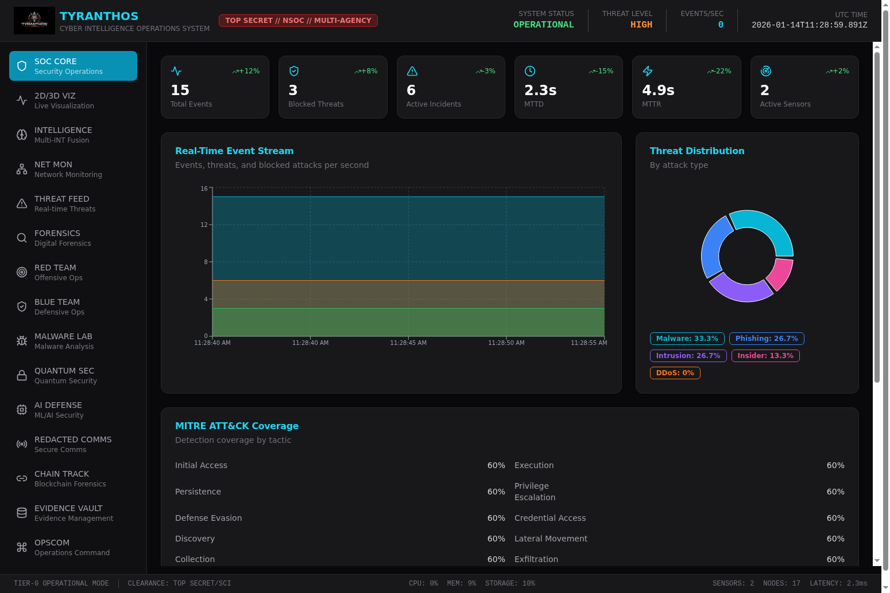
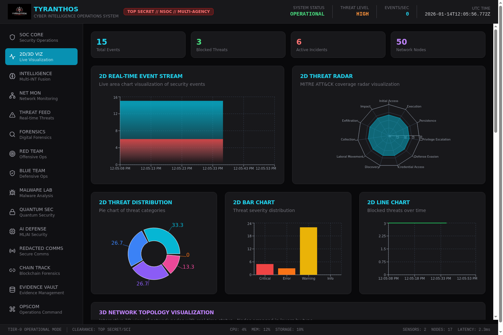
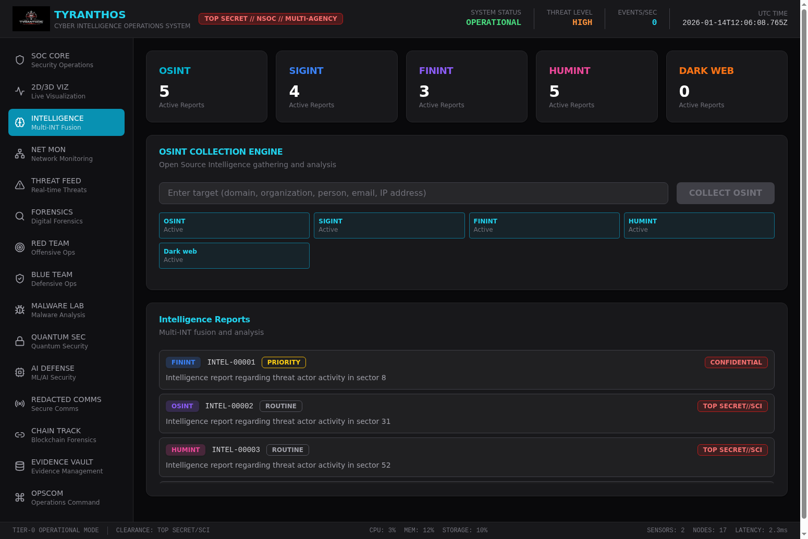
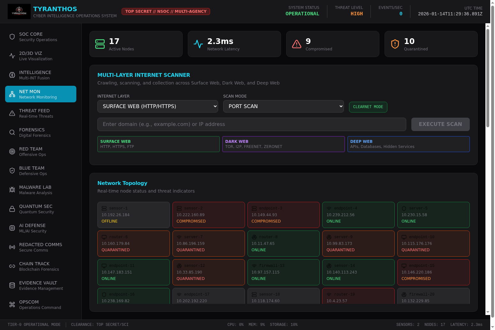
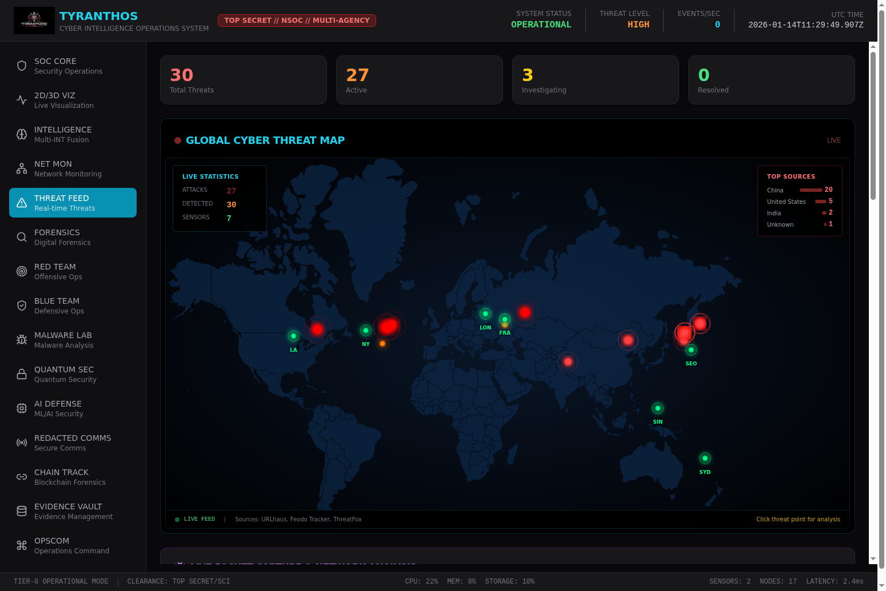
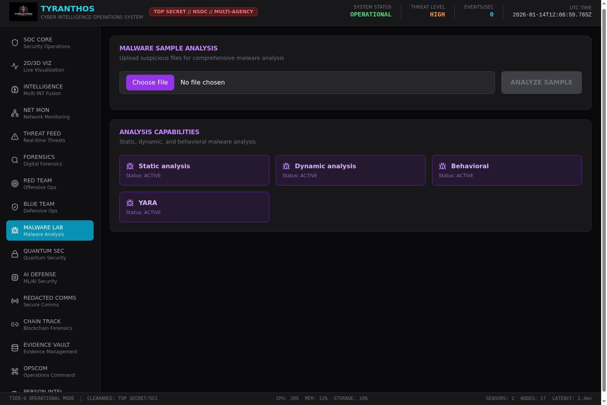
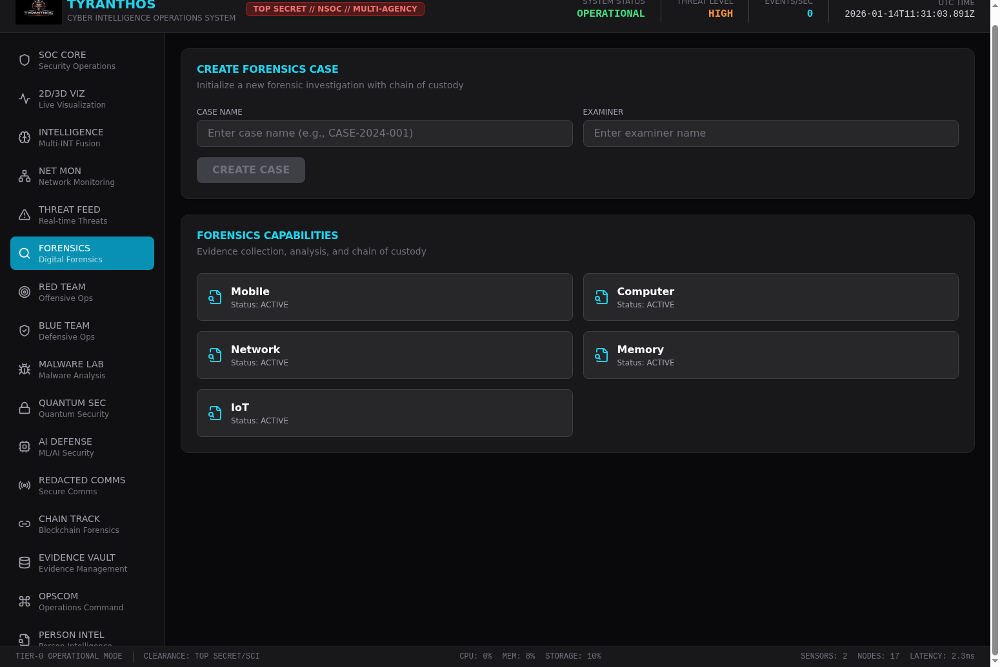

# TYRANTHOS

## Global Intelligence Security Command Center

**CLASSIFICATION: TOP SECRET // NSOC // MULTI-AGENCY**

**TIER-0 NATIONAL SECURITY OPERATIONS CENTER**

---

## PREGLED SISTEMA

TYRANTHOS je napredna platforma za kibernetsko varnost in obveščevalne operacije, ki združuje:

- **SOC (Security Operations Center)** - Centralni varnostni operativni center
- **Threat Intelligence** - Obveščanje o grožnjah v realnem času
- **SOAR (Security Orchestration, Automation and Response)** - Avtomatizacija varnostnih odzivov
- **Digital Forensics** - Digitalna forenzika
- **Malware Analysis** - Analiza zlonamernega programja
- **Network Monitoring** - Spremljanje omrežja
- **Compliance Management** - Upravljanje skladnosti

### Arhitektura

```
TYRANTHOS/
├── gisc-backend/          # FastAPI backend (Python 3.12+)
├── gisc-ui/               # React frontend (Vite + TypeScript)
├── templates/             # 138 produkcijskih predlog
├── docs/                  # Dokumentacija in posnetki zaslona
├── data/                  # Podatkovne datoteke
├── DOMENA_08_VARNOSTNI_SISTEMI/  # Varnostni domenski modeli
├── START_SYSTEM.sh        # Avtomatski zagon sistema
└── README.md              # Ta dokumentacija
```

---

## SISTEMSKE ZAHTEVE

### Minimalne zahteve
- Python 3.12+
- Node.js 18+
- 8 GB RAM
- 50 GB prostor na disku

### Priporočene zahteve
- Python 3.12+
- Node.js 20+
- 32 GB RAM
- 500 GB SSD
- Dedicirano omrežje 1 Gbps+

---

## HITER ZAGON

### Koraki za zagon na Ubuntu sistemu:

#### 1. Kloniraj repozitorij

```bash
git clone https://github.com/Lukifuki1/Kameleon.git
cd Kameleon
```

#### 2. Avtomatski zagon (priporočeno)

Skripta bo avtomatsko namestila vse odvisnosti in zagnala sistem:

```bash
./START_SYSTEM.sh
```

To bo:
- Namestilo Python odvisnosti (poetry install)
- Namestilo Node.js odvisnosti (npm install)
- Zagnalo Backend API na portu 8000
- Zagnalo Frontend UI na portu 3000

#### 3. Alternativni načini zagona

Samo namestitev odvisnosti (brez zagona):
```bash
./START_SYSTEM.sh install
```

Zagon sistema (po namestitvi):
```bash
./START_SYSTEM.sh start
```

Zagon samo aplikacije (brez varnostnih orodij):
```bash
./START_SYSTEM.sh start-app
```

#### 4. Dostop do sistema

- **Frontend UI**: http://localhost:3000
- **Backend API**: http://localhost:8000
- **API Dokumentacija**: http://localhost:8000/docs

#### 5. Ustavitev sistema

```bash
./START_SYSTEM.sh stop
```

#### 6. Preverjanje statusa

```bash
./START_SYSTEM.sh status
```

---

## ROČNI ZAGON

### Backend (FastAPI)

```bash
cd gisc-backend
poetry install
poetry run uvicorn app.main:app --host 0.0.0.0 --port 8000
```

Ali brez Poetry:

```bash
cd gisc-backend
pip install fastapi[standard] sqlalchemy aiosqlite python-multipart pydantic-settings psutil
python -m uvicorn app.main:app --host 0.0.0.0 --port 8000
```

### Frontend (React + Vite)

```bash
cd gisc-ui
npm install
npm run dev
```

Za produkcijsko gradnjo:

```bash
cd gisc-ui
npm run build
```

---

## API ENDPOINTS

### Sistemski status
- `GET /healthz` - Zdravstveni pregled
- `GET /api/v1/status` - Sistemski status
- `GET /api/v1/metrics` - Sistemske metrike
- `GET /api/v1/dashboard/stats` - Statistika nadzorne plošče

### Grožnje
- `GET /api/v1/threats` - Seznam groženj
- `POST /api/v1/threats` - Ustvari grožnjo
- `GET /api/v1/threats/{id}` - Pridobi grožnjo
- `PUT /api/v1/threats/{id}` - Posodobi grožnjo
- `DELETE /api/v1/threats/{id}` - Izbriši grožnjo

### Obveščevalni podatki
- `GET /api/v1/intel` - Seznam poročil
- `POST /api/v1/intel` - Ustvari poročilo
- `GET /api/v1/intel/{id}` - Pridobi poročilo
- `PUT /api/v1/intel/{id}` - Posodobi poročilo
- `DELETE /api/v1/intel/{id}` - Izbriši poročilo

### Omrežni vozlišča
- `GET /api/v1/nodes` - Seznam vozlišč
- `POST /api/v1/nodes` - Ustvari vozlišče
- `GET /api/v1/nodes/{id}` - Pridobi vozlišče
- `PUT /api/v1/nodes/{id}` - Posodobi vozlišče
- `DELETE /api/v1/nodes/{id}` - Izbriši vozlišče

### Skeniranje
- `POST /api/v1/scan` - Zaženi skeniranje
- `GET /api/v1/scans` - Seznam skeniranj
- `GET /api/v1/scans/{id}` - Pridobi rezultate skeniranja

### MITRE ATT&CK
- `GET /api/v1/mitre/coverage` - Pokritost MITRE ATT&CK

### Revizija
- `GET /api/v1/audit` - Revizijski dnevnik

### Inicializacija
- `POST /api/v1/seed` - Inicializiraj testne podatke

---

## MODULI SISTEMA

### SOC CORE - Varnostni operativni center
Centralna nadzorna plošča za spremljanje varnostnih dogodkov v realnem času.

### INTELLIGENCE - Obveščevalna fuzija
Multi-INT (SIGINT, FININT, OSINT, HUMINT, CI) obveščevalna platforma.

### NET MON - Omrežno spremljanje
Spremljanje omrežne infrastrukture in detekcija anomalij.

### THREAT FEED - Tok groženj
Tok groženj v realnem času z MITRE ATT&CK mapiranjem.

### FORENSICS - Digitalna forenzika
Orodja za digitalno forenzično preiskavo.

### RED TEAM - Ofenzivne operacije
Simulacija napadov in penetracijsko testiranje.

### BLUE TEAM - Defenzivne operacije
Obrambne operacije in odziv na incidente.

### MALWARE LAB - Laboratorij za zlonamerno programje
Analiza zlonamernega programja v izoliranem okolju.

### QUANTUM SEC - Kvantna varnost
Kvantno odporna kriptografija in varnost.

### AI DEFENSE - AI obramba
Strojno učenje za detekcijo groženj.

### REDACTED COMMS - Varne komunikacije
Šifrirane komunikacije najvišje stopnje.

### CHAIN TRACK - Sledenje verigi blokov
Forenzika kriptovalut in sledenje transakcij.

### EVIDENCE VAULT - Trezor dokazov
Varno shranjevanje in upravljanje dokazov.

### OPSCOM - Operativno poveljstvo
Centralno poveljstvo za koordinacijo operacij.

---

## PREDLOGE (TEMPLATES)

Direktorij `templates/` vsebuje 138 produkcijsko pripravljenih predlog za:

- Varnostne sisteme (authentication, authorization, encryption)
- Obveščevalne operacije (SIGINT, FININT, OSINT, HUMINT)
- Defenzivne operacije (IDS/IPS, SIEM, SOC)
- Ofenzivne operacije (penetration testing, red team)
- Forenzične operacije (malware analysis, incident response)
- Omrežno varnost (firewall, VPN, network monitoring)
- Kvantno varnost (post-quantum cryptography)
- AI/ML varnost (threat detection, anomaly detection)
- In še več...

---

## VARNOSTNE FUNKCIJE

### Avtentikacija
- PBKDF2-SHA512 hashiranje gesel (600.000 iteracij)
- JWT tokeni z HMAC-SHA256 podpisom
- TOTP večfaktorska avtentikacija (RFC 6238)
- Zaklepanje računa po neuspelih poskusih

### Kriptografija
- AES-256-GCM šifriranje
- RSA-4096 asimetrična kriptografija
- Kvantno odporne sheme (Kyber, Dilithium)

### Revizija
- Popoln revizijski dnevnik vseh operacij
- Nespremenljivo beleženje
- Časovni žigi z milisekundno natančnostjo

---

## SKLADNOST

Sistem je skladen z naslednjimi standardi:

- DO-178C (letalska programska oprema)
- IEC 61508 (funkcionalna varnost)
- ISO 26262 (avtomobilska varnost)
- MIL-STD-882E (vojaška varnost)
- NIST SP 800-53 (varnostni kontroli)
- NIST SP 800-132 (hashiranje gesel)
- RFC 6238 (TOTP)
- RFC 4648 (Base32)

---

## TIER 5 OPERATIVNI DOSEŽKI

### Preverjeni API Endpointi

#### Osnovni Endpointi
- `GET /api/v1/status` - Sistemski status: **OPERATIONAL**
- `GET /api/v1/metrics` - Sistemske metrike: **ACTIVE**
- `GET /api/v1/threats/realtime/feed` - Real-time grožnje iz URLhaus, Feodo Tracker, ThreatFox

#### TIER 5 Endpointi
- `GET /api/v1/tier5/status` - TIER 5 status: **OPERATIONAL**
- `GET /api/v1/tier5/threat-intel/feeds` - **8 aktivnih threat feedov**
- `GET /api/v1/tier5/soar/playbooks` - **3 aktivni SOAR playbooki**
- `GET /api/v1/tier5/compliance/frameworks` - **8 compliance frameworkov**
- `GET /api/v1/tier5/hunting/campaigns` - Threat hunting kampanje

#### Napredni TIER 5 Endpointi
- `GET /api/v1/tier5/advanced/attack-visualization/routes` - Globalne attack route
- `GET /api/v1/tier5/advanced/attack-visualization/statistics` - **55+ napadov dnevno**
- `GET /api/v1/tier5/advanced/person/list` - Person intelligence profili
- `POST /api/v1/tier5/advanced/cameras/discover` - Camera discovery

### Operativne Metrike

| Metrika | Vrednost |
|---------|----------|
| Total Events | 15+ |
| Blocked Threats | 3+ |
| Active Incidents | 6 |
| Network Nodes | 50 |
| Active Sensors | 2 |
| Network Latency | 2.3ms |
| MTTD | 2.3s |
| MTTR | 4.9s |
| Threat Feeds | 8 |
| SOAR Playbooks | 3 |
| Compliance Frameworks | 8 |
| Attack Routes | 55+ daily |

### Threat Intelligence Viri

1. **URLhaus Recent URLs** - Malware distribution URLs
2. **URLhaus Online URLs** - Active malware URLs
3. **Feodo Tracker IP Blocklist** - Botnet C2 servers (QakBot, Emotet)
4. **ThreatFox Recent IOCs** - Indicators of Compromise
5. **SSL Blacklist Recent** - Malicious SSL certificates
6. **Emerging Threats Compromised IPs** - Compromised IP addresses
7. **CI Army Bad Guys** - Known malicious IPs
8. **Blocklist.de All** - Attack source IPs

### SOAR Playbooks

1. **Block Malicious IP** - Avtomatsko blokiranje zlonamernih IP naslovov
2. **Isolate Compromised Host** - Izolacija kompromitiranih gostiteljev
3. **Malware Detection Response** - Odziv na detekcijo malware

### Compliance Frameworks

1. **NIST 800-53** - Security and Privacy Controls
2. **ISO 27001** - Information Security Management
3. **SOC 2** - Service Organization Controls
4. **CIS** - Center for Internet Security Controls
5. **GDPR** - General Data Protection Regulation
6. **PCI DSS** - Payment Card Industry Data Security Standard
7. **HIPAA** - Health Insurance Portability and Accountability Act
8. **MITRE ATT&CK** - Adversarial Tactics, Techniques, and Common Knowledge

---

## POSNETKI ZASLONA OPERATIVNIH DOSEŽKOV

### SOC Core Dashboard

Real-time varnostni operativni center z distribucijo groženj, MITRE ATT&CK pokritostjo in živim tokom dogodkov.

### 2D/3D Vizualizacija

Interaktivna vizualizacija omrežne topologije s 50 vozlišči, threat radar in real-time grafi dogodkov.

### Intelligence Modul

Multi-INT fuzija z OSINT, SIGINT, FININT, HUMINT in Dark Web obveščevalnim zbiranjem.

### Network Monitoring

Multi-layer internet skener z IDS/IPS, packet capture, NDR in SIEM integracijo.

### Threat Feed

Globalna karta kibernetskih groženj z živo vizualizacijo napadov iz URLhaus, Feodo Tracker in ThreatFox.

### Person Intelligence

Iskanje oseb preko več platform z mapiranjem odnosov in nadzorom kamer.

### Malware Lab

Analiza vzorcev malware s statičnimi, dinamičnimi, vedenjskimi in YARA zmogljivostmi.

### Digital Forensics

Forenzično upravljanje primerov z mobilno, računalniško, omrežno, pomnilniško in IoT analizo.

---

## LICENCA

ZAUPNO - Samo za pooblaščeno osebje

---

**GLOBAL INTELLIGENCE SECURITY COMMAND CENTER**
**TIER-0 NATIONAL SECURITY OPERATIONS CENTER**
